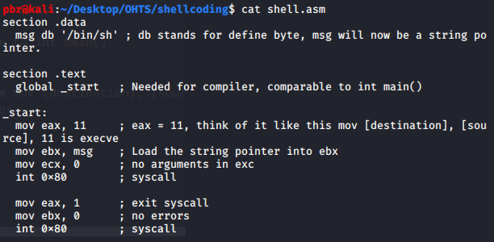
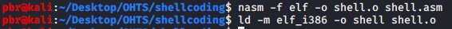
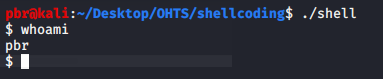
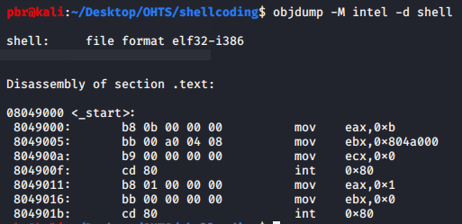

To learning shellcoding we should have to have knowledge about,
>Assembly Language

>C Language

And also we need how to work "stack" and all other terms related to shellcoding.

Stack [Introduction]: https://www.freecodecamp.org/news/data-structures-stacks-on-stacks-c25f2633c529/

Assembly [Cheat sheet]: https://www.google.com/url?sa=t&rct=j&q=&esrc=s&source=web&cd=1&ved=2ahUKEwiU5rfgtYvoAhVMyjgGHaIvApIQFjAAegQIAhAB&url=https%3A%2F%2Fcs.brown.edu%2Fcourses%2Fcs033%2Fdocs%2Fguides%2Fx64_cheatsheet.pdf&usg=AOvVaw384MVXQDBtyM1pPW3LeZrW

You can findout "What is the stack and how it works" and Assembly cheat sheet on above links.

**********************************************************************************************************************************
***What is Shellcode??***

Shellcode is a piece of machine-readable code or script code that is used to do specific task on server or else some PC. Most of the attackers are using this to exploit targeted sources. 

**********************************************************************************************************************************

***Let's try to understand simple shellcode***

Above picture shows a program using Assembly language. This code file will with ***.asm*** extension. 

You can try with above code with creating ***shell.asm***. 

To compile this code file you can using below commands.

***If you don't have "nasm" on your linux machine you can download with it "apt-get install nasm".***

Above codes are using in the x64 bit architecture processors. If you are using x32 bit architecture processor you can use below code segment.

>ld -o shell shell.o

After that it will be given executable file. That has contained specific code which will be provided us a "shell". In figure which is below will show you that shell has opened.

To run that executable file you can use,

>./shell

Let's try to extract that executable file. To extract that one can be done by the command which is given below,

>objdump -M intel -d shell

